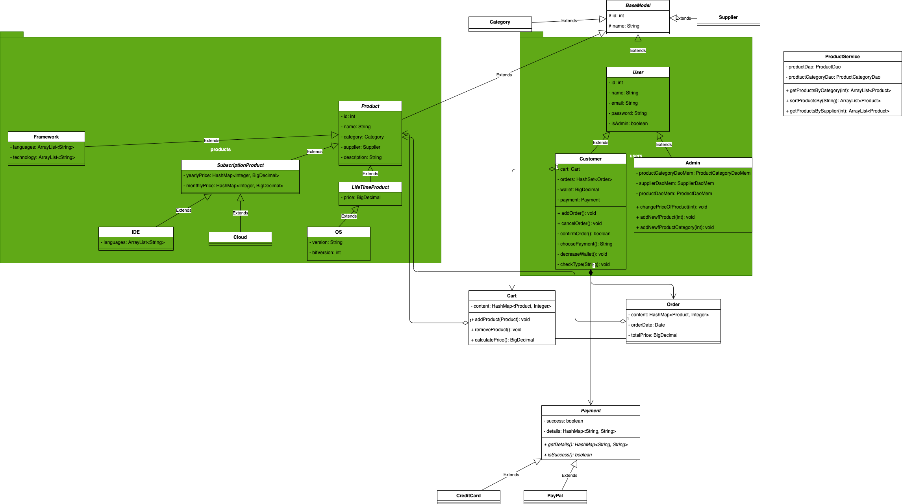
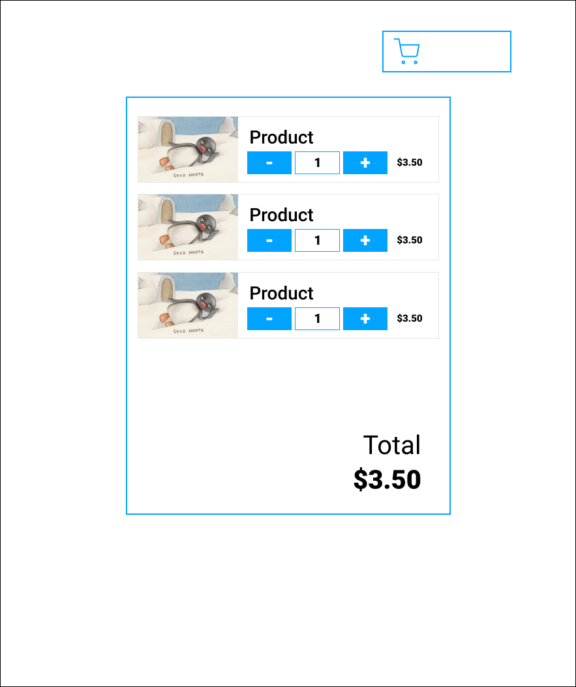

# Codecool shop

This project is a school project where our task was to create a basic shop in two week-long sprints. Since this was more a Java OOP project we were initially supposed to use Tymeleaf, a templating engine, however we opted for React as we felt we were ready to try it out. My personal contribution amounts more or less to the shopping cart's code and some pair programming on the rest -- we made sure to keep each other up to date on the progress we made.

Note that the version found in the `master` branch is not the current version, as the front end was completely reworked by my teammate who wanted to experiment with Redux, which I can't take credit for. If you're curious, check out the `development` branch.

Also enjoy these files that we created in the process of planning this application.

First, the UML diagram for the backend:

And herewith a couple of design files that I created in Figma. We more or less followed the structure, but freestyled a bit when it came to the actual implementation:

and the shopping cart:

